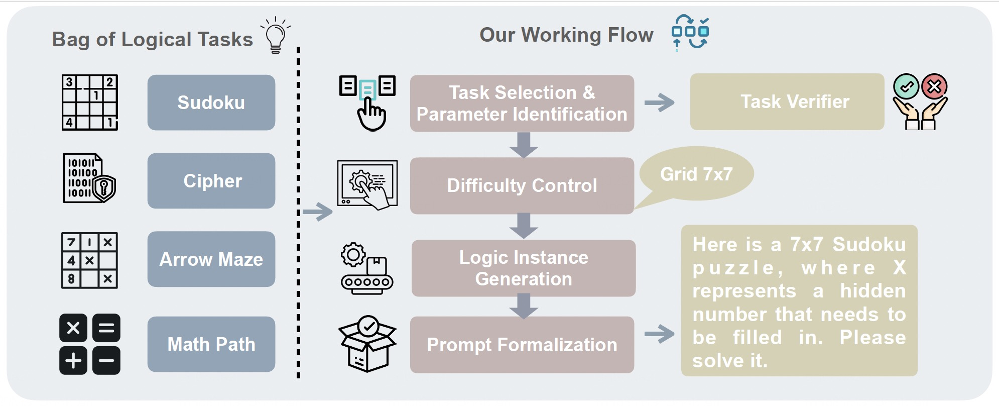

# SynLogic

This repository contains the code and data for SynLogic, a comprehensive logical reasoning data synthesis framework that generates diverse, verifiable reasoning data at scale. Our work addresses the critical gap in high-quality logical reasoning training data for developing general reasoning capabilities in Large Language Models (LLMs).

<p align="center">
  
</p> 

## News
- :fire: [05/2025] We are excited to release the resources for the paper "SynLogic: Synthesizing Verifiable Reasoning Data at Scale for Learning Logical Reasoning and Beyond"

## 📋 Overview

**SynLogic** is a data synthesis framework and comprehensive dataset that:
- 📊 **Covers 35 diverse logical reasoning tasks** including Sudoku, Game of 24, Cipher, Arrow Maze, and more
- 🎯 **Enables controllable difficulty synthesis** with adjustable parameters for each task
- ✅ **Provides verifiable rewards** through rule-based verification for RL training
- 🚀 **Achieves SOTA performance** among open-source datasets, surpassing DeepSeek-R1-Distill-Qwen-32B by 6 points on BBEH

### Key Features
- **Scalable Data Generation**: Unlimited synthesis with controllable difficulty levels
- **Comprehensive Task Coverage**: 35 distinct logical reasoning tasks with custom generators and verifiers
- **RL-Ready**: All examples can be verified by simple rules, making them ideal for reinforcement learning
- **Cross-Domain Transfer**: Strong generalization to mathematical and coding domains

## 🚀 Quick Start

### Installation
```bash
git clone https://github.com/YOUR_REPO/SynLogic.git
cd SynLogic
pip install -r requirements.txt
```

### Generate Sample Data (Arrow Maze Example)
```bash
# Quick example with Arrow Maze
bash games/tasks/arrow_maze/run.sh

# Or with custom parameters
python scripts/arrow_maze.py \
  --num_of_data 1000 \
  --width 5 \
  --height 5 \
  --arrow_fill_rate_min 0.3 \
  --arrow_fill_rate_max 0.9
```


## :rocket: Resources

### Datasets
| Dataset Name | Description | Link |
|:------------:|:------------|:----:|
| **SynLogic** | Training dataset | [🤗 HuggingFace]() |


## 🙏 Acknowledgments

We thank all our colleagues at MiniMAX for their invaluable contributions to developing the SynLogic framework and dataset. Special thanks to:

**MiniMAX Team**: Yuanxiang Fan, Zhuo Jiang, Han Ding, Yongyi Hu, Chi Zhang, Yiqi Shi, Shitong Weng, Aili Chen, Mozhi Zhang, Pengyu Zhao, and Junjie Yan for their dedicated work on data synthesis, framework development.

**Academic Collaborators**: Shiqi Chen from The City University of Hong Kong for valuable insights and contributions to the research.

**HKUST NLP Team**: Junxian He for research guidance and supervision throughout the project.

## 🔄 Future Updates

We are actively working on expanding SynLogic with more logical reasoning tasks.

Follow our repository for the latest updates and releases!


